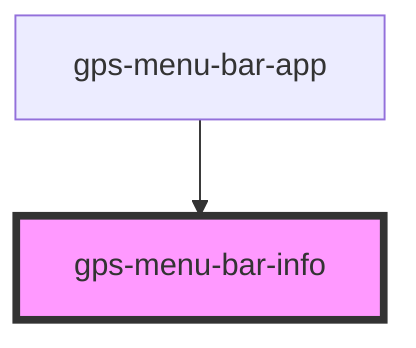

# gps-menu-bar-info

<!-- Auto Generated Below -->

## Properties

| Property     | Attribute     | Description | Type                                                                                                                                                       | Default     |
| ------------ | ------------- | ----------- | ---------------------------------------------------------------------------------------------------------------------------------------------------------- | ----------- |
| `avatarSize` | `avatar-size` |             | `number`                                                                                                                                                   | `28`        |
| `profile`    | --            |             | `{ user: { name: string; email: string; signingKey?: string; }; core?: { editor?: string; excludesfile?: string; }; init?: { defaultBranch?: string; }; }` | `undefined` |

## Dependencies

### Used by

 - [gps-menu-bar-app](../menu-bar-app)

### Graph

----------------------------------------------

*Built with [StencilJS](https://stenciljs.com/)*
