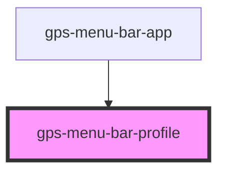

# gps-menu-bar-profile

<!-- Auto Generated Below -->

## Properties

| Property               | Attribute | Description | Type                                                                                                                                                       | Default     |
| ---------------------- | --------- | ----------- | ---------------------------------------------------------------------------------------------------------------------------------------------------------- | ----------- |
| `profile` _(required)_ | --        |             | `{ user: { name: string; email: string; signingKey?: string; }; core?: { editor?: string; excludesfile?: string; }; init?: { defaultBranch?: string; }; }` | `undefined` |

## Events

| Event     | Description | Type                                                                                                                                                                    |
| --------- | ----------- | ----------------------------------------------------------------------------------------------------------------------------------------------------------------------- |
| `updated` |             | `CustomEvent<{ user: { name: string; email: string; signingKey?: string; }; core?: { editor?: string; excludesfile?: string; }; init?: { defaultBranch?: string; }; }>` |

## Dependencies

### Used by

 - [gps-menu-bar-app](../menu-bar-app)

### Graph

----------------------------------------------

*Built with [StencilJS](https://stenciljs.com/)*
