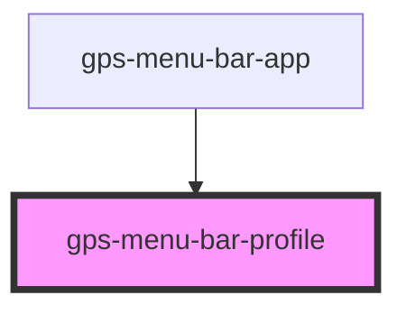

# gps-menu-bar-profile

<!-- Auto Generated Below -->

## Properties

| Property               | Attribute          | Description | Type                                                                                                                                                        | Default     |
| ---------------------- | ------------------ | ----------- | ----------------------------------------------------------------------------------------------------------------------------------------------------------- | ----------- |
| `alreadyExisting`      | `already-existing` |             | `boolean`                                                                                                                                                   | `false`     |
| `isNew`                | `is-new`           |             | `boolean`                                                                                                                                                   | `false`     |
| `profile` _(required)_ | --                 |             | `{ user: { email: string; name?: string; signingKey?: string; }; core?: { editor?: string; excludesfile?: string; }; init?: { defaultBranch?: string; }; }` | `undefined` |

## Events

| Event     | Description | Type                                                                                                                                                                     |
| --------- | ----------- | ------------------------------------------------------------------------------------------------------------------------------------------------------------------------ |
| `changed` |             | `CustomEvent<{ user: { email: string; name?: string; signingKey?: string; }; core?: { editor?: string; excludesfile?: string; }; init?: { defaultBranch?: string; }; }>` |
| `remove`  |             | `CustomEvent<{ user: { email: string; name?: string; signingKey?: string; }; core?: { editor?: string; excludesfile?: string; }; init?: { defaultBranch?: string; }; }>` |
| `update`  |             | `CustomEvent<{ user: { email: string; name?: string; signingKey?: string; }; core?: { editor?: string; excludesfile?: string; }; init?: { defaultBranch?: string; }; }>` |

## Dependencies

### Used by

 - [gps-menu-bar-app](../menu-bar-app)

### Graph

----------------------------------------------

*Built with [StencilJS](https://stenciljs.com/)*
