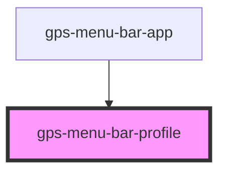

# gps-menu-bar-profile

<!-- Auto Generated Below -->

## Properties

| Property  | Attribute | Description | Type      | Default |
| --------- | --------- | ----------- | --------- | ------- |
| `email`   | `email`   |             | `string`  | `''`    |
| `name`    | `name`    |             | `string`  | `''`    |
| `visible` | `visible` |             | `boolean` | `false` |

## Events

| Event     | Description | Type                                                                 |
| --------- | ----------- | -------------------------------------------------------------------- |
| `updated` |             | `CustomEvent<{ name: string; email: string; signingKey?: string; }>` |

## Dependencies

### Used by

 - [gps-menu-bar-app](../menu-bar-app)

### Graph

----------------------------------------------

*Built with [StencilJS](https://stenciljs.com/)*
