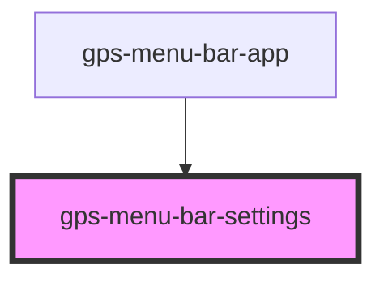

# gps-menu-bar-icon-settings

<!-- Auto Generated Below -->

## Properties

| Property                | Attribute  | Description | Type                                                                                                                                  | Default     |
| ----------------------- | ---------- | ----------- | ------------------------------------------------------------------------------------------------------------------------------------- | ----------- |
| `disabled`              | `disabled` |             | `boolean`                                                                                                                             | `false`     |
| `settings` _(required)_ | --         |             | `{ general: { autoStart: boolean; theme: { overrideSystem: boolean; prefer?: Theme; }; }; profiles: { [email: string]: Profile; }; }` | `undefined` |

## Events

| Event           | Description | Type                                                                                                                                               |
| --------------- | ----------- | -------------------------------------------------------------------------------------------------------------------------------------------------- |
| `open`          |             | `CustomEvent<void>`                                                                                                                                |
| `themeSelected` |             | `CustomEvent<"dark" \| "light">`                                                                                                                   |
| `updated`       |             | `CustomEvent<{ general: { autoStart: boolean; theme: { overrideSystem: boolean; prefer?: Theme; }; }; profiles: { [email: string]: Profile; }; }>` |

## Dependencies

### Used by

 - [gps-menu-bar-app](../menu-bar-app)

### Graph

----------------------------------------------

*Built with [StencilJS](https://stenciljs.com/)*
