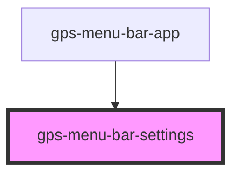

# gps-menu-bar-icon-settings

<!-- Auto Generated Below -->

## Properties

| Property   | Attribute  | Description | Type                                                                                                                    | Default     |
| ---------- | ---------- | ----------- | ----------------------------------------------------------------------------------------------------------------------- | ----------- |
| `disabled` | `disabled` |             | `boolean`                                                                                                               | `false`     |
| `settings` | --         |             | `{ general: { autoStart: boolean; }; git: { editor?: string; }; theme: { overrideSystem: boolean; prefer?: Theme; }; }` | `undefined` |
| `visible`  | `visible`  |             | `boolean`                                                                                                               | `false`     |

## Events

| Event     | Description | Type                                                                                                                                 |
| --------- | ----------- | ------------------------------------------------------------------------------------------------------------------------------------ |
| `updated` |             | `CustomEvent<{ general: { autoStart: boolean; }; git: { editor?: string; }; theme: { overrideSystem: boolean; prefer?: Theme; }; }>` |

## Dependencies

### Used by

 - [gps-menu-bar-app](../menu-bar-app)

### Graph

----------------------------------------------

*Built with [StencilJS](https://stenciljs.com/)*
