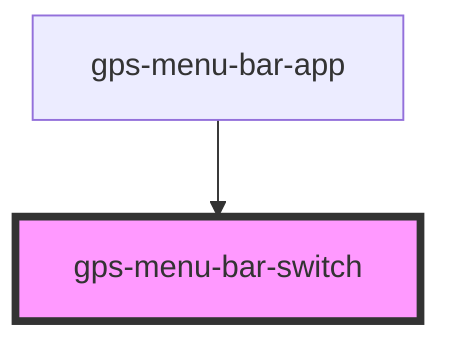

# gps-menu-bar-switch

<!-- Auto Generated Below -->

## Properties

| Property   | Attribute  | Description | Type       | Default     |
| ---------- | ---------- | ----------- | ---------- | ----------- |
| `current`  | `current`  |             | `string`   | `undefined` |
| `disabled` | `disabled` |             | `boolean`  | `false`     |
| `items`    | --         |             | `string[]` | `[]`        |

## Events

| Event    | Description | Type                  |
| -------- | ----------- | --------------------- |
| `switch` |             | `CustomEvent<string>` |

## Dependencies

### Used by

 - [gps-menu-bar-app](../menu-bar-app)

### Graph

----------------------------------------------

*Built with [StencilJS](https://stenciljs.com/)*
